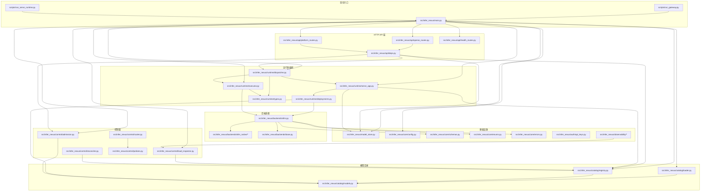
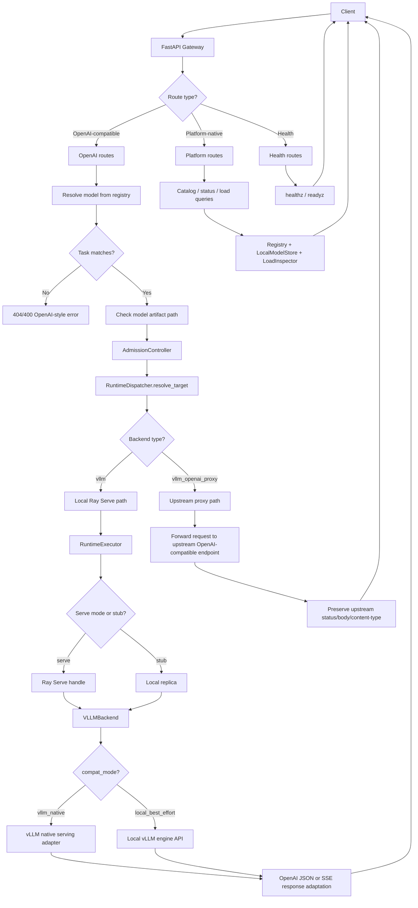

# infer-nexus Architecture

## 1. Overview

`infer-nexus` is a shared inference service factory for internal development and testing environments. It is designed to replace the current pattern where each user deploys and maintains their own model inference services on shared accelerator servers.

The project uses:
- `Python` as the implementation language
- `uv` for dependency and environment management
- `Ray Serve` for deployment lifecycle, routing, and autoscaling support
- `vLLM` as the local runtime backend
- CUDA GPU and Huawei Ascend NPU as supported accelerator platforms
- OpenAI-compatible upstream proxying for compatibility-sensitive models
- OpenAI-compatible northbound APIs for client compatibility

Primary goals:
- Share accelerator resources across teams and users
- Expose a single inference endpoint instead of many scattered endpoints
- Pre-register and centrally manage commonly used models
- Support elastic scaling for high-demand models
- Provide platform-native APIs for model discovery and cluster load inspection
- Keep the system simple enough for internal developer adoption

Out of scope for Phase 1:
- Web UI
- Fine-grained user or team resource isolation
- Fully dynamic model registration
- Multi-backend coexistence
- Cross-cluster scheduling

## 2. Design Principles

1. Pre-registered models only
   - All supported models are declared in configuration and managed by the platform.
   - This keeps resource usage predictable and operational behavior controlled.

2. Single northbound endpoint
   - Clients use a single service entrypoint.
   - Internally, requests are routed to model-specific Ray Serve deployments or explicitly configured upstream proxy targets.

3. OpenAI-compatible first
   - Existing internal applications should require little or no code change.
   - Platform-specific capabilities are exposed through separate native APIs.

4. Shared accelerator pool
   - All locally hosted model services use the same accelerator pool.
   - CUDA GPU and Ascend NPU are selected at the platform configuration layer.
   - No user-level hardware reservation or hard partitioning in Phase 1.

5. Warm replicas for low-frequency large models
   - Low-frequency but expensive models keep a minimum replica count.
   - This avoids slow cold starts in developer workflows.

6. Clear separation of control plane and data plane responsibilities
   - Ray Serve is the serving runtime for local models.
   - `infer-nexus` provides catalog, routing, admission control, proxying, and platform APIs.

## 3. High-Level Architecture

```text
Client
  -> infer-nexus API Gateway
      -> OpenAI-Compatible API Layer
      -> Native Platform API Layer
      -> Auth / Admission / Routing
          -> Model Catalog
          -> Backend Dispatch per Model
              -> vllm_openai_proxy -> Upstream vLLM/OpenAI-compatible server
              -> vllm (local) -> Ray Serve Deployments -> replica-local vLLM Runtime
                 -> CUDA GPU or Ascend NPU resource pool
          -> Load Inspector
          -> Scaling Policy
```

### Module Relationship Diagram



### Responsibilities by layer

#### API Gateway
- Exposes one HTTP entrypoint
- Handles request authentication (`待实现`)
- Separates OpenAI-compatible APIs from platform-native APIs
- Applies request admission checks before dispatch

#### Model Catalog
- Stores pre-registered model metadata
- Maps logical model names to runtime deployments
- Exposes discovery information to users and routing logic

#### Routing Layer
- Resolves the requested model
- Selects the correct task path based on model type
- Dispatches by backend type:
  - `vllm_openai_proxy`: forwards to configured upstream `/v1/...` endpoint
  - `vllm`: dispatches to matching local Ray Serve deployment

#### Load Inspector and Admission Control
- Aggregates runtime health and load indicators
- Decides whether requests should be admitted or rejected early (`待实现`)
- Supports cluster and model load inspection APIs (`待实现`)

#### Scaling Policy Layer
- Uses inference-related metrics such as queue length, TTFT, and latency
- Adjusts deployment replica counts within configured limits (`待实现`)

#### Ray Serve Runtime
- Owns deployment lifecycle and replica management
- Handles internal routing to replicas
- Maps per-replica accelerator demand to CUDA `num_gpus` or Ray custom `NPU` resources based on platform configuration
- Exposes runtime and deployment metrics through Prometheus-compatible endpoints

#### vLLM Backend
- Runs the actual model inference engines
- Owns vLLM engine startup, shutdown, runtime spec validation, and task dispatch
- Selects request behavior through `compat_mode`
  - `vllm_native`: strict replica-local vLLM serving adapter path
  - `local_best_effort`: existing local engine API path
  - `strict_openai`: backward-compatible alias for `vllm_native` on chat configs
- In `vllm_native` chat mode, delegates compatibility-sensitive OpenAI chat
  behavior to `src/infer_nexus/backends/vllm_native/chat.py` and passes native
  response or SSE chunks through without local delta reconstruction
- In `vllm_native` embedding mode, uses an injected native embeddings serving
  adapter contract and fails clearly if that adapter is unavailable; constructing
  the real vLLM 0.18 embeddings serving object is still pending target-runtime
  validation
- In `local_best_effort` chat mode, uses replica-local `AsyncLLMEngine` where
  available, maps cumulative vLLM `RequestOutput` objects to internal
  `chat_delta` events, and lets `RuntimeExecutor` encode OpenAI-compatible SSE
- Keeps sync `vllm.LLM` chat, `LLM.embed`, and `LLM.score` paths for
  local-best-effort development, stubs, and fallback behavior
- Keeps rerank local-best-effort only in the current implementation;
  `vllm_native` rerank is rejected because vLLM rerank serving protocols are not
  OpenAI-compatible
- Supports the same backend abstraction on CUDA and Ascend environments; Ascend
  deployments rely on the environment-provided `vllm-ascend` runtime stack

#### OpenAI Proxy Backend
- Preserves northbound SDK compatibility (`base_url + model`)
- Forwards request payloads to upstream OpenAI-compatible servers
- Keeps response semantics close to upstream behavior, including SSE streaming
- Supports per-model upstream header policies such as request-id forwarding
- Supports optional client `Authorization` header forwarding to upstream services (`待实现`)
- Supports chat, embeddings, and rerank proxy dispatch in the current implementation

## 4. Core Decisions

### 4.1 Model registration mode
Phase 1 uses pre-registration only.

Implications:
- Models are defined in a configuration file
- Service startup loads model definitions into the catalog
- A reconciliation step ensures Ray Serve deployments match the declared state

Future-compatible extension:
- The architecture may later add controlled dynamic registration APIs
- This is intentionally not part of the initial implementation

### 4.2 Deployment granularity
Phase 1 uses one Ray Serve deployment per local model.

Rationale:
- Simpler autoscaling boundaries
- Clear ownership of metrics and health
- Easier troubleshooting
- Easier mapping from `/v1/models` and catalog metadata to runtime state

For proxy-backed models, the gateway routes to one explicitly configured upstream endpoint per model. The gateway does not own an upstream replica pool in this phase.

### 4.3 Accelerator resource model
All locally hosted models share one accelerator pool. In CUDA environments this
pool is exposed to Ray as GPUs. In Ascend environments this pool is exposed to
Ray as custom `NPU` resources.

Rationale:
- Matches the current internal environment
- Keeps scheduling and operations simple
- Maximizes hardware sharing in development and testing
- Keeps model configuration portable across CUDA and Ascend by treating
  `gpu_per_replica` as logical accelerator demand

Constraint:
- Resource admission must avoid accepting traffic the cluster cannot serve reasonably
- Fractional accelerator scheduling alone does not guarantee per-model physical device separation

### 4.4 Resource pool boundary vs deployment resource requests
The platform must distinguish between two separate concerns:

1. Resource pool boundary
   - Defines how much accelerator capacity is assigned to the entire `infer-nexus` platform
   - This is set at the Ray node or cluster process boundary
   - Example: make only 4 A100 GPUs or 4 Ascend NPUs visible to the Ray runtime used by `infer-nexus`

2. Deployment resource requests
   - Defines how much of that shared pool each deployment replica consumes
   - This is expressed through Ray or Ray Serve resource requirements such as GPU count per replica or custom NPU resources
   - This does not bind a deployment to specific device IDs ahead of time

Phase 1 should implement platform-level pooling, not static per-deployment device pinning.

#### Recommended CUDA pattern
For CUDA environments, the recommended pattern is:
- limit the GPUs visible to the Ray node that runs `infer-nexus`
- start Ray with a matching GPU resource count
- let Ray Serve schedule replicas inside that bounded pool

Conceptually:
- `CUDA_VISIBLE_DEVICES=0,1,2,3` defines the total GPU pool visible to `infer-nexus`
- Ray then treats that pool as 4 schedulable GPU resources
- a deployment with `num_gpus=1` consumes one unit from the pool
- a deployment with `num_gpus=4` consumes the full pool

This means `CUDA_VISIBLE_DEVICES` is still useful, but only to define the platform resource boundary. It should not be used as a per-model or per-deployment static binding mechanism.

#### Recommended Ascend pattern
For Ascend environments, the same principle applies, with NPU-specific resource
mapping:
- set `cluster.inference_device_type: npu` in `config/settings.yaml`
- define the visible NPU set through `ASCEND_RT_VISIBLE_DEVICES`
- start Ray with a matching custom resource declaration such as
  `--resources '{"NPU": 4}'`
- let Ray Serve schedule replicas by consuming `resources: {"NPU": gpu_per_replica}`

Current implementation details:
- `DeploymentFactory(inference_device_type="npu")` maps the model's
  `gpu_per_replica` value to Ray actor options `resources: {"NPU": ...}`
  instead of CUDA `num_gpus`
- `scripts/start_minimal_ascend.sh` performs minimal Ascend bootstrap,
  exports `ASCEND_RT_VISIBLE_DEVICES`, sets
  `RAY_EXPERIMENTAL_NOSET_ASCEND_RT_VISIBLE_DEVICES=1`, starts a Ray head with
  custom `NPU` resources when needed, then deploys Serve and the gateway
- `pyproject.ascend.toml`, `dockerfile`, and `docker-compose.yml` describe the
  current Ascend container path, including reliance on a Huawei-provided
  Ascend Docker image that already includes the validated CANN / `torch-npu` /
  `vllm` / `vllm-ascend` / Ray runtime stack

If additional backend-specific environment handling is required for `vllm-ascend`, that logic should remain an implementation detail of the backend integration layer rather than a manual per-deployment operational step.

#### Design rule
The architecture should follow these rules:
- the total hardware budget for `infer-nexus` is defined at the platform or Ray node boundary
- deployments declare only resource demand, not concrete device IDs
- Ray Serve performs scheduling within the visible resource pool
- model configuration describes resource requirements per replica, not fixed device assignments

This separation is necessary to preserve shared-pool scheduling and avoid falling back to manual device partitioning.

#### Operational caveat observed in current implementation
- With fractional CUDA `num_gpus` or fractional custom `NPU` resources such as `0.3` or `0.6`, Ray may co-locate multiple model replicas on one physical accelerator.
- In this mode, deployments can still fail with vLLM KV cache initialization errors even when catalog config is valid.
- For stability-first bring-up, prefer one-replica-per-device (`gpu_per_replica=1`) before reintroducing fractional sharing.

### 4.5 Serving backends
Current implementation supports two backends:

1. `vllm` (local)
2. `vllm_openai_proxy` (upstream OpenAI-compatible proxy)

Rationale:
- `vllm`: good fit when local runtime control and resource ownership are needed
- `vllm_openai_proxy`: highest compatibility with official upstream server behavior
- Ascend support is handled as a platform/runtime variant of the local `vllm`
  backend, not as a separate northbound backend type

Implementation notes:
- Keep backend abstraction thin to avoid hard-coupling gateway logic to one runtime.
- `compat_mode` controls how much OpenAI/vLLM serving protocol behavior is
  delegated to native serving internals:
  - `vllm_native` means request/response semantics should follow vLLM native
    serving as closely as possible; adapter initialization or invocation
    failures are surfaced and must not silently degrade to local fallback logic
  - `local_best_effort` means the backend may use local APIs such as
    `AsyncLLMEngine.generate`, `LLM.chat`, `LLM.embed`, or `LLM.score` and
    perform infer-nexus response shaping
  - `strict_openai` is retained only as a backward-compatible alias for older
    chat configurations
- In `vllm_native` chat mode, the backend builds an OpenAI-style request payload
  from `ChatCompletionsRequest`, rewrites only the served `model` name, merges
  `extra_body`, and hands the payload to the replica-local native serving
  adapter. Streaming bytes and strings are passed through unchanged, while dict
  chunks are framed by the executor as SSE without semantic mutation.
- In `local_best_effort` chat mode, the backend prefers `AsyncLLMEngine` for
  real incremental streaming. It consumes vLLM cumulative `RequestOutput`
  objects, converts them into internal `chat_delta` events, and lets
  `RuntimeExecutor` encode those events as OpenAI-compatible SSE chunks.
- If `AsyncLLMEngine` cannot be initialized in local-best-effort mode, chat
  falls back to sync `LLM`. Streaming remains available as an OpenAI-compatible
  stream in that case, but it is compatibility streaming over a completed
  response rather than token-level incremental streaming.
- Native embedding has a backend contract and payload-preservation tests, but
  real vLLM 0.18 embeddings serving construction still needs target-environment
  validation. Until then, production embedding models should use
  `local_best_effort` or `vllm_openai_proxy`.
- Rerank remains `local_best_effort` for local vLLM. `vllm_native` rerank is
  intentionally rejected in the first pass.
- For compatibility-sensitive models that cannot yet use a validated native
  adapter, prefer `vllm_openai_proxy`.
- A Ray Serve LLM based option was considered: `from ray.serve.llm import
  LLMConfig, build_openai_app`. This could provide a more native Ray Serve
  wrapper around vLLM's OpenAI-compatible behavior. However, the API is still
  treated as beta-stage surface area, and the generated OpenAI application
  overlaps with the existing `infer-nexus` gateway responsibilities such as
  authentication, catalog resolution, alias rewriting, admission control, and
  platform-native APIs.
- If adopted later, Ray Serve LLM should be integrated behind the gateway as an
  internal upstream or backend implementation, not as a replacement for the
  gateway. The gateway may rewrite the client-facing `model` field and forward
  OpenAI-compatible requests to a Ray Serve LLM application, preserving the
  current control-plane boundary while delegating vLLM protocol fidelity to Ray
  Serve LLM.
- The current implementation does not use `build_openai_app`. It does, however,
  support using Ray Serve LLM's `PrefixCacheAffinityRouter` through
  `deployment_config.request_router_config` for local vLLM chat deployments.
  This is a deployment-router integration inside the existing custom gateway and
  Serve deployment path, not adoption of Ray Serve LLM's stock OpenAI ingress.
- On Ascend, the backend assumes the Huawei-provided runtime image has already
  installed and validated CANN, `torch-npu`, `vllm`, `vllm-ascend`, and Ray.
  The application code should avoid replacing those packages during startup.
- Header forwarding policy should remain explicit and model-scoped.
- If `forward_authorization` is enabled for a proxy model, the gateway should forward the inbound client `Authorization` header to the configured upstream service (`待实现`).
- If proxy auth is also configured through static or environment-derived bearer tokens, precedence rules must be defined explicitly before enabling `forward_authorization` (`待实现`).

Current proxy hardening gaps:
- upstream host allowlist validation: `待实现`
- complete inbound header passthrough contract, including `Accept`, conditional `Authorization`, and hop-by-hop header filtering: `待实现`
- request body size limits and stream duration guardrails: `待实现`
- client disconnect and cancellation propagation hardening for streaming proxy paths: `待实现`
- production-oriented proxy metrics and latency histograms: `待实现`
- broad proxy-model migration in `config/models.yaml`: `待实现`

### 4.6 No Web UI
Phase 1 is API-only.

Rationale:
- Internal developer usage does not require a UI initially
- The platform APIs should provide all information needed by tools or scripts

## 5. Supported Model Types

Phase 1 should support these model task categories:
- `chat`
- `embedding`
- `rerank`
- `vlm` as a reserved extension point, even if not fully implemented first

These task categories should remain explicit in the internal model schema because:
- Request/response formats differ
- Scaling signals differ slightly by task type
- Validation and routing differ by task type

## 6. Northbound API Design

## 6.1 OpenAI-compatible APIs

Required in Phase 1:
- `GET /v1/models`
- `POST /v1/chat/completions`
- `POST /v1/embeddings`
- `POST /v1/rerank`

Recommended later:
- `POST /v1/responses`

### Behavior expectations
- The `model` field is resolved through the catalog
- The client sees stable logical model names or aliases
- Errors should follow consistent JSON error semantics
- For proxy-backed models, request payloads should be forwarded with minimal transformation, ideally rewriting only the upstream `model` field
- For proxy-backed models, upstream status code, body, and content type should be preserved where the failure occurs upstream rather than in the gateway
- Proxy-backed embeddings and rerank requests are supported by the current implementation even though the original proxy rollout was described as chat-first
- Streaming support for chat completions should be considered part of the design, even if implemented after the first non-streaming version
  - local `vllm` streaming plumbing exists end to end
  - `vllm_native` chat streams native serving chunks through without local delta
    reconstruction
  - `local_best_effort` chat streaming is implemented through replica-local
    `AsyncLLMEngine` when available
  - sync `LLM` fallback still emits OpenAI-compatible SSE, but without true
    token-level incrementality
  - proxy stream cancellation and disconnect hardening: `待实现`

## 6.2 Native platform APIs

Required in Phase 1:
- `GET /api/catalog/models`
- `GET /api/catalog/models/{model_name}`
- `GET /api/models/{model_name}/status`
- `GET /api/cluster/load`
- `GET /api/cluster/capacity`
- `GET /healthz`
- `GET /readyz`

### API intent

#### `GET /api/catalog/models`
Returns the registered model list with metadata such as:
- logical name
- task type
- backend
- capabilities
- current status
- deployment name
- min/max replicas

#### `GET /api/catalog/models/{model_name}`
Returns a single model's configuration and current runtime view.

#### `GET /api/models/{model_name}/status`
Returns operational status such as:
- readiness
- current replicas (`待实现`)
- inflight requests (`待实现`)
- queue length (`待实现`)
- recent TTFT and latency summaries (`待实现`)
- admission state (`待实现`)

#### `GET /api/cluster/load`
Returns a summarized runtime load view for the shared inference factory.

Example payload shape:
- total accelerators (`待实现`)
- allocated accelerators (`待实现`)
- free accelerator estimate (`待实现`)
- active models
- pending scale actions (`待实现`)
- rejection pressure state (`待实现`)

#### `GET /api/cluster/capacity`
Returns a more static or planning-oriented view of cluster resources and configured model demands (`待实现`).

#### `GET /healthz`
Liveness probe for the API process.

#### `GET /readyz`
Readiness probe endpoint exists in the current implementation, but it is still a
placeholder and currently returns the same success response as `healthz`.
Dependency-aware readiness checks remain `待实现`.

## 7. Request Lifecycle

### 7.1 Chat, embedding, or rerank request flow

```text
Client request
  -> API validation
  -> authentication
  -> model resolution via catalog
  -> admission control check
  -> backend dispatch
      -> proxy backend: upstream OpenAI-compatible request/response passthrough
      -> local backend:
          -> vllm_native: route to model-specific Ray Serve deployment -> vLLM native serving adapter -> passthrough response/SSE
          -> local_best_effort: route to model-specific Ray Serve deployment -> local vLLM engine API -> infer-nexus response/SSE adaptation
  -> client response
```

### Request Flow Diagram



### 7.2 Model discovery request flow

```text
Client request
  -> API layer
  -> catalog query
  -> optional runtime state enrichment
  -> response
```

### 7.3 Load inspection request flow

```text
Client request
  -> API layer
  -> metrics/state aggregation
  -> cluster summary computation
  -> response
```

## 8. Model Catalog Design

The catalog is the control-plane source of truth for supported models.

Each model entry should include at least:
- `name`: stable internal identifier
- `alias`: external logical name used by clients
- `task`: `chat`, `embedding`, `rerank`, or `vlm`
- `backend`: initially `vllm` or `vllm_openai_proxy`
- `compat_mode`: `local_best_effort` by default, or `vllm_native` for local
  vLLM models that should use replica-local native serving semantics; legacy
  `strict_openai` is accepted only as a chat alias
- `model_path`: Hugging Face ID or local model path for locally hosted models
- `deployment_name`: Ray Serve deployment identifier for locally hosted models
- `dtype`
- `tensor_parallel_size`
- `max_model_len`
- `gpu_memory_utilization`
- `gpu_per_replica`
- `min_replicas`
- `max_replicas`
- `status`
- `capabilities`: optional list such as `streaming`, `vision`, `tool_calling`
- `labels`: arbitrary internal tags

### Catalog responsibilities
- Load configuration at startup
- Validate schema correctness
- Resolve aliases to canonical model definitions
- Expose discovery metadata to `/v1/models` and native APIs
- Provide deployment mapping for routers and controllers

## 9. Configuration Model

Configuration should be declarative and file-based in Phase 1.

Recommended initial files:
- `config/settings.yaml`
- `config/models.yaml`
- `pyproject.toml` for the default development/runtime dependency set
- `pyproject.ascend.toml` for the Ascend container dependency boundary

## 9.1 Local Model Store and Offline Registration

Phase 1 should use a local model store as the preferred source for model weights. Runtime services should prioritize loading from local paths and should not download model weights as part of normal request handling or service startup. At the same time, the platform may reference remote model services through explicitly configured proxy-style backends.

### Design rules
- locally managed model weights should live under a configured local model store root
- runtime loading should prefer locally available model files
- model download is an offline administrative operation, not part of the serving control plane
- model registration remains declarative and file-based
- the download workflow must not automatically mutate the main model registry configuration
- remote model service references are allowed only through explicit backend configuration, not through implicit runtime downloads

### Operational workflow
The intended Phase 1 workflow is:
1. an administrator runs a standalone download script
2. the script downloads a model into the local model store
3. the script prints a suggested model configuration snippet
4. the administrator reviews that output and manually adds the model entry to `config/models.yaml`
5. the service starts or reloads using only models already present in configuration and on local disk

This keeps the serving path simple and avoids coupling model artifact acquisition to runtime lifecycle operations. It also preserves the current implementation shape where some models may be served by forwarding to an already-running remote OpenAI-compatible endpoint.

### Local model store responsibilities
The local model store concept in Phase 1 is intentionally narrow:
- define a root directory for model artifacts
- provide a stable location for runtime model loading
- support reuse of previously downloaded weights across restarts and replicas

The local model store is not a full artifact-management subsystem in Phase 1. It should not introduce dynamic registration, automatic cleanup policies, or online model acquisition during request handling.

### Download script behavior
The standalone download script should:
- download model weights into the configured local model store
- support Hugging Face downloads through `hf-mirror.com` under mainland China network conditions
- optionally support additional sources later, such as ModelScope
- perform lightweight validation that expected model files exist
- print a suggested configuration block for manual registration

The script should not directly edit `config/models.yaml`. Manual review and registration is preferred to keep configuration changes explicit and auditable.

### Configuration implications
Platform settings should include a local model store root, for example through `config/settings.yaml`. Model definitions in `config/models.yaml` should prefer local model paths for locally hosted models. When a model is intentionally served by an upstream service, its configuration may instead reference that remote service through backend-specific proxy settings.

For proxy-style models, backend-specific settings may include:
- upstream base URL
- upstream model name override
- upstream auth mode
- timeout and retry policy
- streaming passthrough flags
- request-id forwarding policy
- client `Authorization` header forwarding policy (`待实现`)
- upstream host allowlist enforcement (`待实现`)
- request header passthrough policy beyond request-id and static auth (`待实现`)

A relative path under the configured model store root is preferred over a machine-specific absolute path. This keeps configuration more portable across environments.

Current implementation note:
- proxy runtime support exists in code, but the checked-in `config/models.yaml` still primarily uses local `vllm` backends; broad proxy migration remains `待实现`
- local `vllm` models now also support backend-scoped request behavior in
  configuration, including `vllm.request_defaults`, `vllm.request_policy`, and
  `vllm.openai_serving`
- `compat_mode` defaults to `local_best_effort`; `vllm_native` is available for
  local vLLM chat and embedding models, while local vLLM rerank explicitly stays
  `local_best_effort`
- `vllm_native` chat currently requires `vllm.openai_serving.enabled: true`
  because the replica constructs vLLM OpenAI chat serving objects inside the
  existing Ray Serve replica rather than starting a separate HTTP server
- platform accelerator selection is configured in `config/settings.yaml` through
  `cluster.inference_device_type`, currently `cuda` or `npu`
- on `cuda`, Serve deployments request Ray CUDA resources through `num_gpus`
- on `npu`, Serve deployments request Ray custom resources through
  `resources: {"NPU": gpu_per_replica}`; the Ray cluster must be started with a
  matching custom `NPU` resource budget

### 9.2 Ascend Runtime Packaging

Ascend support is intentionally packaged as a platform-specific runtime
environment rather than a separate application architecture. The current
implementation uses a Huawei-provided Ascend Docker image as the runtime base;
that image already contains the NPU runtime stack and core inference/serving
components such as `torch-npu`, `vllm`, `vllm-ascend`, and Ray.

Current files:
- `pyproject.ascend.toml` constrains packages that are expected to be provided
  by the Huawei Ascend base image, including `torch-npu`, `vllm`, `vllm-ascend`,
  and Ray
- `dockerfile` builds from the current Huawei Ascend base image and syncs the project
  using the Ascend pyproject
- `docker-compose.yml` mounts Ascend device nodes, driver/tooling paths, model
  storage, and the working tree into the container
- `scripts/start_minimal_ascend.sh` starts the minimal Ray Serve plus gateway
  flow on Ascend NPU

Operational assumptions:
- CANN, device drivers, runtime libraries, and `npu-smi` are provided by the
  host/container environment before `infer-nexus` starts
- the service does not install or mutate the NPU runtime stack at application
  startup
- cross-platform code behavior is selected by configuration, primarily
  `cluster.inference_device_type` in `config/settings.yaml`; model-serving code
  should not require separate CUDA-only or Ascend-only request paths
- `ASCEND_RT_VISIBLE_DEVICES` defines the NPU visibility boundary for the
  platform process
- Ray custom `NPU` resources must match the accelerator budget intended for
  `infer-nexus`

### Runtime implications
At runtime, `infer-nexus` should:
- load only models declared in `config/models.yaml`
- resolve each locally hosted model to a local filesystem path
- fail clearly if a configured local model is missing from local storage
- avoid implicit remote downloads when starting deployments or serving requests
- pass model memory/context constraints (`max_model_len`, `gpu_memory_utilization`) through backend runtime specs
- allow explicitly configured upstream proxy models to bypass local artifact checks

Example model declaration:

```yaml
models:
  - name: qwen3-32b-instruct
    alias: qwen3-chat
    task: chat
    backend: vllm
    compat_mode: local_best_effort
    model_path: Qwen/Qwen3-32B-Instruct
    dtype: bfloat16
    tensor_parallel_size: 4
    max_model_len: 32768
    gpu_per_replica: 4
    min_replicas: 1
    max_replicas: 4
    capabilities:
      - streaming
    labels:
      - internal
      - llm

  - name: bge-large-zh-v15
    alias: bge-embedding
    task: embedding
    backend: vllm
    compat_mode: local_best_effort
    model_path: BAAI/bge-large-zh-v1.5
    dtype: float16
    tensor_parallel_size: 1
    max_model_len: 8192
    gpu_per_replica: 1
    min_replicas: 1
    max_replicas: 2
    labels:
      - internal
      - embedding
```

### Why configuration must stay out of code
- Easier model onboarding
- Easier review and change control
- Cleaner separation between platform logic and platform inventory
- Better compatibility with future reconciliation or reload workflows

## 10. Admission Control

Admission control is required even without user-level resource isolation.

Its purpose is to reject requests early when service quality would otherwise collapse.

Current implementation status:
- admission decision logic: `待实现`
- only the gateway integration point exists today

### Admission inputs
Per-model signals:
- deployment readiness
- current replica count
- inflight requests
- request queue length
- recent TTFT
- recent p95 latency
- deployment at max replicas or not

Cluster-level signals:
- available accelerator capacity estimate
- pending scale-up actions
- recent rejection pressure

### Admission outcomes
- admit request
- reject with `429 Too Many Requests` (`待实现`)
- reject with `503 Service Unavailable` (`待实现`)

### Error scenarios to encode clearly
- unknown model
- model not ready
- model overloaded
- cluster capacity exhausted
- invalid request for model task type

This is preferable to accepting every request and failing later with long timeouts.

## 11. Autoscaling Strategy

Phase 1 scaling should be driven by inference-oriented metrics, not just low-level infrastructure metrics.

Current implementation status:
- scaling controller logic: `待实现`
- automatic replica adjustment wiring: `待实现`
- threshold configuration fields exist, but policy execution is not connected yet

### Primary scaling signals
- `queue_length`
- `ttft`
- `p95_latency`
- `inflight_requests`

### Secondary supporting signals
- `tokens_per_second`
- `gpu_utilization`
- `gpu_memory_utilization`

### Why these metrics
- `queue_length` directly reflects contention
- `ttft` is the most meaningful user-facing stress indicator for LLM workloads
- `p95_latency` protects overall request quality
- `inflight_requests` helps detect sustained pressure

### Suggested scale-up rules
Scale up when any of these conditions persist for a configured window:
- queue length above threshold
- TTFT above threshold
- p95 latency above threshold

Only scale up if:
- current replicas are below `max_replicas`
- cluster accelerator capacity can satisfy the additional replica
- projected per-replica memory headroom can still satisfy vLLM KV cache initialization

### Suggested scale-down rules
Scale down when all of these conditions remain true for a configured cool-down window:
- queue length near zero
- TTFT within target
- low inflight request count
- replicas above `min_replicas`

### Task-type-specific tuning
The architecture should support different policies per task type.

Examples:
- chat: TTFT and latency weighted more heavily
- embedding: queue length and throughput weighted more heavily
- rerank: queue length and latency weighted more heavily

## 12. Runtime State and Reconciliation

The system should maintain a clear difference between:
- desired state from configuration
- observed runtime state from Ray Serve and metrics

A reconciliation loop should:
- ensure configured models exist in the catalog
- ensure deployments exist for registered models (`待实现`)
- ensure deployment settings match current desired configuration (`待实现`)
- surface mismatches and degraded status to platform APIs (`待实现`)

This does not require full dynamic hot registration in Phase 1. It only requires that the platform can compare declared state with actual state.

Current implementation status:
- reconciliation loop execution: `待实现`

## 13. Observability

Ray Serve's built-in Prometheus support should be used directly for runtime metrics. `infer-nexus` should add business-level and control-plane metrics on top.

Current implementation status:
- custom metrics emission: `待实现`
- runtime metric aggregation into platform APIs: `待实现`
- proxy per-model request counters and status breakdowns: `待实现`
- proxy upstream latency histograms: `待实现`
- proxy stream lifecycle counters: `待实现`

### Recommended custom metrics
- `infer_nexus_requests_total`
- `infer_nexus_request_latency_seconds`
- `infer_nexus_ttft_seconds`
- `infer_nexus_model_requests_total`
- `infer_nexus_model_inflight_requests`
- `infer_nexus_model_queue_length`
- `infer_nexus_admission_rejections_total`
- `infer_nexus_model_status`

### Monitoring views the platform should support
- per-model request volume
- per-model TTFT and latency (`待实现`)
- per-model scaling behavior (`待实现`)
- per-model rejection counts (`待实现`)
- cluster accelerator allocation summary (`待实现`)
- degraded model states (`待实现`)
- proxy upstream latency and error breakdown (`待实现`)
- proxy stream lifecycle visibility (`待实现`)

### Logging recommendations
Structured logs should include:
- request id (`待实现`)
- model name
- task type
- admission decision (`待实现`)
- deployment name
- proxy upstream host (`待实现`)
- proxy upstream model name (`待实现`)
- latency summary (`待实现`)
- failure reason when applicable

## 14. Error Model

The platform should define a consistent error format across OpenAI-compatible and native APIs where practical.

Recommended classes of failure:
- model not found
- model unavailable
- model overloaded
- cluster capacity exhausted
- invalid parameter
- backend runtime failure

OpenAI-compatible APIs should preserve expected HTTP semantics and JSON structure as closely as practical, while native APIs can expose more explicit platform-specific fields.

For proxy-backed requests, upstream HTTP status and upstream error payload should take priority whenever the failure occurs upstream. Gateway-generated errors should be reserved for gateway-stage failures such as model lookup, backend misconfiguration, or upstream connectivity failures.

## 15. Security and Access Control

Phase 1 does not require complex tenant isolation, but basic access control is still necessary.

Minimum recommendations:
- API key authentication (`待实现`)
- request identity in logs and metrics (`待实现`)
- strict upstream host allowlist for proxy models (`待实现`)
- explicit `Authorization` forwarding policy for proxy models (`待实现`)
- max request body size enforcement (`待实现`)
- max stream duration guardrails for proxy streaming (`待实现`)
- optional per-key rate limiting later

Rationale:
- Prevent accidental misuse
- Preserve auditability
- Keep a path open for future quota controls without redesigning the gateway

## 16. Proposed Codebase Layout

```text
src/
  infer_nexus/
    api/
      openai_routes.py
      platform_routes.py
      health_routes.py
      deps.py
    auth/
      api_keys.py
    backends/
      base.py
      vllm.py
      vllm_native/
        __init__.py
        chat.py
        common.py
        embedding.py
    catalog/
      models.py
      registry.py
      loader.py
    control/
      admission.py
      load_inspector.py
      reconciler.py
      scaler.py
      policies.py
    runtime/
      deployments.py
      dispatcher.py
      executor.py
      handles.py
      serve_app.py
      types.py
    observability/
      metrics.py
      logging.py
    core/
      config.py
      enums.py
      errors.py
      schemas.py
    main.py
config/
  settings.yaml
  models.yaml
docker-compose.yml
dockerfile
pyproject.toml
pyproject.ascend.toml
tests/
scripts/
  run_gateway.py
  run_serve_runtime.py
  start_minimal.sh
  start_minimal_ascend.sh
```

### Layout rationale
- `api/` defines northbound HTTP behavior
- `catalog/` owns model metadata and discovery
- `control/` owns admission, scaling, and reconciliation logic
- `runtime/` owns Ray Serve integration points
- `backends/` isolates inference engine details
- `backends/vllm_native/` isolates compatibility-sensitive vLLM native serving
  wrappers from the local best-effort engine paths
- `observability/` centralizes metrics and logging concerns

## 17. Phase 1 Implementation Scope

Phase 1 should implement only the minimum platform needed to replace ad hoc personal deployments.

### Must-have
- file-based pre-registered model catalog
- one deployment per local model
- OpenAI-compatible chat, embeddings, and rerank APIs
- native model discovery APIs
- native load inspection APIs
- basic admission control (`待实现`)
- metric-driven autoscaling hooks (`待实现`)
- Prometheus metrics integration (`待实现`)
- API key authentication (`待实现`)

### Nice-to-have but not required for Phase 1
- full target-environment validation of `vllm_native` chat and embedding against
  `vllm serve` behavior on Ray 2.48.0 + vLLM 0.18.x
- native `responses` API support
- config reload and deployment reconcile without full process restart

## 18. Future Extensions

The following should remain possible without architectural rework:
- controlled dynamic registration
- deeper Ascend runtime hardening, including more explicit NPU health and
  capacity reporting
- richer rerank and multimodal support
- stronger quota and rate-limit controls
- admin APIs for model lifecycle operations
- a thin internal UI built on top of native APIs
- convergence from the current two-process startup shape toward a single operator-facing startup flow while preserving one external API entrypoint

## 19. Recommended Next Step

The next implementation artifact should be a repository scaffold that matches this architecture but keeps Phase 1 scope disciplined.

Recommended immediate deliverables:
1. project skeleton with `uv`
2. config schema and model catalog loader
3. FastAPI gateway with placeholder OpenAI-compatible routes
4. Ray Serve integration skeleton
5. admission and metrics interfaces

This keeps the first coding step aligned with the intended runtime architecture instead of drifting into ad hoc service assembly.
